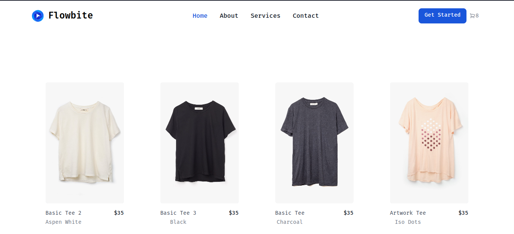

# 🎨 Arteum: Shopping for art made easy

A modern web platform for trading art and other collectibles.

## 🖼️ Preview

## ✨ Features

- 🛒 Add and manage items in your shopping cart
- 👤 User authentication (login/register/logout)
- 📦 Checkout panel using Headless UI
- 🔍 Browse and explore art listings
- 🔄 Persistent state with Redux
- 💡 Responsive and mobile-friendly design

## 🛠️ Tech Stack

- **Frontend:** React, Tailwind CSS, Headless UI
- **State Management:** Redux Toolkit
- **Routing:** React Router
- **Backend:** Node.js, Express _(planned/integrated)_
- **Database:** MongoDB _(planned/integrated)_
